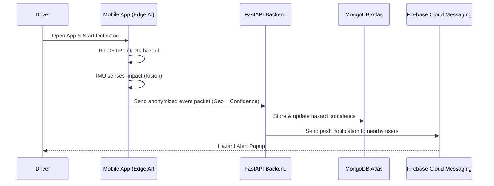

# 🚗 RoadSafe AI — Intelligent Road Hazard Detection & Real-Time Alert System

> **Team:** GG_Coders    
> **Problem Statement:** Road Hazard Detection & Real-Time Alerts

---

## 🌍 Overview

RoadSafe AI transforms **any smartphone into a proactive, real-time road hazard detection device**, creating an **intelligent, crowd-sourced safety network**.  
By fusing **AI-based visual detection** with **physical sensor data (IMU)**, we verify hazards instantly and alert nearby drivers — enhancing road safety across India.

---

## 💡 The Next-Generation Approach

### 1️⃣ Fuse Data Streams with Transformer AI
- Runs **RT-DETR (Real-Time Detection Transformer)** on the live camera feed.
- Monitors the **Inertial Measurement Unit (IMU)** — accelerometer and gyroscope.
- Uses **attention mechanisms** for superior contextual understanding of road scenes.

### 2️⃣ Generate Dynamic Confidence Score (Sensor Fusion)
- Vision-only detection → low confidence.
- Vision + IMU impact → instant **high-confidence hazard**.
- Enables verification **from a single user** device.

### 3️⃣ Privacy-First Edge Processing
- All processing and blurring (faces, license plates) happens **on-device**.
- Transmits only **anonymized, geotagged** event packets to the cloud.

### 4️⃣ Instant Verified Alerts
- Cloud backend aggregates verified events.
- Sends **push notifications (FCM)** to users on nearby routes via **FastAPI backend**.

---

## 🧠 System Architecture (Mermaid Diagram)

```mermaid
flowchart TD
    A[Smartphone Camera + IMU Sensors] --> B[On-Device AI (RT-DETR + IMU Fusion)]
    B --> C[Real-Time Blurring (Mediapipe + OpenCV)]
    C --> D[Geo-Tagged Event Packet]
    D --> E[FastAPI Backend]
    E --> F[MongoDB Atlas (Geo Queries)]
    E --> G[Hazard Confidence Scoring Engine]
    G --> H[Firebase Cloud Messaging (FCM)]
    H --> I[Driver's Mobile App — Live Alert]
```

---

## 🧩 Use-Case Diagram (Mermaid)

```mermaid
usecaseDiagram
    actor Driver
    actor CloudBackend as "Cloud Backend"
    actor Other Drivers
    Driver --> (Detect Hazard)
    Driver --> (Receive Alert)
    (Detect Hazard) --> (Sensor Fusion AI)
    (Sensor Fusion AI) --> CloudBackend
    CloudBackend --> (Aggregate Verified Hazards)
    Other Drivers--> (View Hazard Reports)
    CloudBackend --> (Send Push Notification)
```

---

## ⚙️ Technologies Used

| Layer | Technology | Purpose |
|-------|-------------|----------|
| **Frontend (Mobile)** | React Native | Cross-platform app |
| **On-Device AI** | TensorFlow Lite / PyTorch Mobile | Run RT-DETR locally |
| **Model** |MobileNet Transformer | RT-DETR Transformer | Real-time contextual detection |
| **Sensor Fusion** | Android SensorManager | IMU access |
| **Mapping & Location** | Google Maps API | Geo-coordinates, routing |
| **Backend** | FastAPI (Python) | High-performance event processing |
| **Database** | MongoDB Atlas for MVP | Geo-spatial databases for scalable applications|
| **Push Notifications** |Real-time alerts with websockets|

---

## 🧬 Process Flow



---

## 🔄 Sensor Fusion Details

```mermaid
flowchart TD
    A[Accelerometer] --> D[IMU Data]
    B[Gyroscope] --> D
    C[Camera Feed (RT-DETR)] --> E[Hazard Detector]
    D --> F[Sensor Fusion Engine]
    E --> F
    F --> G[Dynamic Hazard Confidence Score]
    G --> H[Upload Anonymized Event]
```

> The **Sensor Fusion Engine** correlates visual detections with IMU motion data in real time.  
> Verified bumps, tilts, or jerks are combined with AI predictions to create a **Dynamic Hazard Confidence Score** — ensuring that only high-confidence, verified hazards are reported to the network.

---

## Key Features

### Core Safety
- Real-Time Hazard Detection (AI vision)
- Instant Verified Alerts (via FCM)
- Privacy-First Edge Design (no sensitive data leaves device)

### Technical
- **On-Device Sensor Fusion** (Vision + IMU)
- **Edge AI** for low latency
- **Automatic GeoTagging**
- **Dynamic Hazard Scoring** (Self-learning backend)

### Cloud Features
- Hazard aggregation and verification logic
- Real-time geofenced notifications
- Dashboard-ready MongoDB backend for municipal reporting

---

## 🏗️ Architecture Overview

| Component | Description |
|------------|--------------|
| **Edge Device** | Runs RT-DETR, sends verified packets |
| **FastAPI Backend** | Receives, validates, and scores events |
| **MongoDB Atlas** | Stores hazard data with GPS coordinates |
| **FCM** | Pushes alerts to relevant users |
| **Dashboard (Future)** | Allows municipalities to view live hazard map |

---

## Potential Impact

- Prevents accidents via proactive alerts  
- Aids city infrastructure planning with data-driven maintenance  
- Reduces congestion and secondary collisions  
- Builds India’s first live **Road Safety Network**

---

## Estimated Implementation Cost

| Component | Estimated Cost | Notes |
|------------|----------------|-------|
| Cloud Backend | AWS EC2 / Google Cloud Run | Scalable, minimal |
| Database | MongoDB Atlas | Free tier sufficient |
| Mapping API | Google Maps API / Mapbox | Usage-based |
| Push Notifications | Firebase Cloud Messaging | Free |
| Model Training | Colab Pro / AWS SageMaker | One-time cost |

---

## Our Vision

> “To build a truly intelligent, privacy-preserving road safety network that proactively prevents accidents, transforming passive journey data into active, life-saving intelligence.”

---

## 📺 Demo Resources

- **APK Download:** [Coming Soon](#)
- **Demo Video:** [YouTube Link](#)
- **Figma Wireframes:** [View on Figma](https://www.figma.com/design/45ZP4wfx65KC9FpFcEBRRV/Untitled)
- **Backend API:** [To be deployed on Render/Vercel](#)

---

## 🏁 Future Scope
- Integration with **Municipal Dashboards** for automated road repair prioritization.
- **Multi-Sensor Fusion** with external IoT sensors (car OBD / dashcams).
- Deploying a **national crowd-sourced road safety map**.

---

## 🛠️ Repository Structure (Example)

```
RoadSafeAI/
├── android/
│   ├── app/
│   └── build.gradle
├── model/
│   └── hazard_detector.tflite
├── backend/
│   ├── main.py
│   ├── requirements.txt
│   └── utils/
├── assets/
│   └── demo_videos/
└── README.md
```
---

> 📩 **For Judges and Reviewers:**  
> You can experience the live demo directly through our hosted Appetize.io link or download the APK from our release page.
